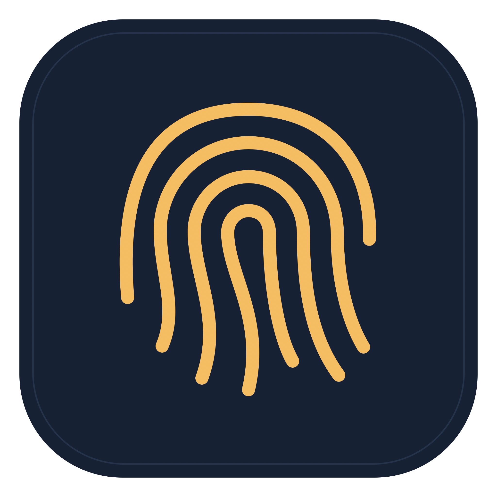

# TouchGate



A small macOS menu-bar app that asks for Touch ID when you open protected apps. Keep chats and other windows private when someone walks up to your unlocked Mac, while leaving background messages and tasks running.

## Install on macOS

Requires macOS 14+, a working Touch ID sensor, and an enrolled fingerprint.

1. Download from [the latest release](https://github.com/imranbarbhuiya/touchgate/releases/latest): [Apple silicon (arm64)](https://github.com/imranbarbhuiya/touchgate/releases/latest/download/TouchGate-macos-arm64.zip) or [Intel (x64)](https://github.com/imranbarbhuiya/touchgate/releases/latest/download/TouchGate-macos-x64.zip).
2. Unzip and drag **TouchGate.app** to **Applications** (or your user's `~/Applications` folder).
3. Search for **TouchGate** in Raycast or Spotlight, or open it in Finder. Reopen it the same way after quitting; no Terminal is needed.

Reopening a running app shows its settings. Closing settings leaves protection running. Release ZIPs include SHA-256 checksum files. Builds are ad-hoc signed without Developer ID signing or notarization; if macOS blocks opening, follow [Apple's guidance](https://support.apple.com/102445) using System Settings → Privacy & Security. Do not disable Gatekeeper globally.

To update, quit TouchGate and replace the installed app. Your protected-app list stays in macOS preferences. Moving or replacing the app may require re-enabling Accessibility access and checking Start at login again.

## Build from source

Install Xcode command-line tools and run:

```sh
swift test
bash scripts/build.sh
open dist/TouchGate.app
```

Open **Protected apps…** from the shield icon in the menu bar, choose **Add apps…**, and select applications. Touch ID confirms changes to the protected list. Opening a protected app hides its windows and automatically requests Touch ID through Apple's fingerprint control embedded in the unlock window. Evaluation starts after that window is active and key, avoiding a separate system alert competing for focus. Settings cannot take focus from a pending unlock, and a protected app reactivating during authentication brings the existing unlock window forward without replacing its target. **Retry Touch ID** lets you retry after cancelling. The unlock request keeps its original target if hiding it exposes another protected app underneath. While the unlock window is open, TouchGate minimizes protected windows that reappear. Already minimized windows are left alone so the check does not repeatedly hide apps during authentication. **Lock now**, Mac sleep, and screen locking clear the current unlock.

**Ask for Touch ID** has two modes. **Every app switch** is the default and asks again when you return after switching away. **Once per launch** remembers a separate unlock for each running app, including when you close and reopen a window without quitting its process. Quitting/relaunching that app requires authentication again. Both modes relock on Mac sleep, screen locking, **Lock now**, or restarting TouchGate. Changing the mode requires Touch ID and relocks all apps; the selected mode is saved locally.

Some apps, including apps with an accessory activation policy, cannot be hidden through the standard macOS app API. Choose **Allow window control…** and enable TouchGate under System Settings → Privacy & Security → Accessibility. Permission status refreshes when you return to TouchGate; the permission button disappears once access is recognized. With this permission, TouchGate minimizes visible windows and restores only the windows it minimized after authentication. It falls back to standard app hiding when window minimization is unavailable. It does not read chat messages or send keystrokes. If permission is missing or a window cannot be controlled, TouchGate reports the failure; do not treat that app as protected until its windows disappear on locking. macOS grants broad UI-control permission, so enable it only for a build you trust. Updating an ad-hoc signed local build may require toggling its Accessibility entry off and on again.

Closing TouchGate's settings window leaves protection running. Normal quitting requires Touch ID when apps are protected. **Start at login** uses macOS Login Items; approve it in System Settings if requested. You can move the built app to your Applications folder before enabling login startup. Moving or rebuilding it may require re-registering the login item.

TouchGate uses Apple's biometric-only LocalAuthentication policy, disables password fallback, and requests fresh authentication. If Touch ID is locked out or unavailable, protected apps remain locked. Re-enable Touch ID through the normal macOS login/setup flow, then retry. Any fingerprint enrolled for the current macOS account can authenticate; TouchGate cannot select a particular finger or person.

## Background work

TouchGate hides windows; it does not terminate apps, suspend processes, intercept network traffic, or modify protected applications. WhatsApp can still receive messages. Terminal commands and background jobs can continue. Computer-use tools that activate a protected app on this Mac encounter the same unlock gate and need a person to authenticate. Cloud work is separate and unaffected by this local locker.

## Scope

This is a casual privacy barrier, not an OS security boundary. A protected window may briefly appear before the activation notification is handled. Someone with access to the unlocked account can force-quit TouchGate, change its local preferences, or access an app's data or web version. Notifications, notification previews, screenshots, Mission Control, and background windows are not comprehensively protected. Configure sensitive notification previews separately.

Finder and TouchGate itself cannot be added. There is no network service, analytics, account, credential collection, or fingerprint storage. The protected app names, bundle IDs, and installation paths are saved only in macOS preferences for `io.github.imranbarbhuiya.touchgate`, outside this repository. Apple handles the biometric check.

## Build a release

Run `bash scripts/package.sh` on macOS to create the app ZIP and checksum in ignored `dist/`. Packaging includes only the executable, icon, and bundle metadata; local protected-app preferences and logs are excluded.

The [release workflow](.github/workflows/release.yml) tests and builds Apple silicon and Intel packages. A manual workflow run produces downloadable artifacts. Pushing a `v*` tag matching `CFBundleShortVersionString` in `assets/Info.plist` publishes a GitHub Release. Update both version fields in that plist before tagging the next release.

## Development

Swift, SwiftUI, AppKit, LocalAuthentication, LocalAuthenticationEmbeddedUI, and ServiceManagement; no third-party dependencies. State tests cover relocking, switching between protected apps, independent per-process grants, new process identities, termination, and explicit locking. Hardware authentication and window behavior must also be tested on a Mac with Touch ID.

The implementation uses Apple's [LAAuthenticationView](https://developer.apple.com/documentation/localauthenticationembeddedui/laauthenticationview) for embedded biometric UI. A comparison with [FreshLock](https://github.com/tame-gg/freshlock) and [MakLock](https://github.com/dutkiewiczmaciej/MakLock) found an alternative: cover protected windows with overlays while leaving the app visible. That avoids hide/activate churn, but requires tracking window geometry, stacking, multiple displays, and Spaces. The overlay experiment was reverted after live testing exposed app content on hotbar focus and found unreliable biometric focus. See [the findings](docs/overlay-experiment.md). TouchGate retains minimization and avoids repeatedly changing already minimized windows. Launch blocking with Endpoint Security is a different design requiring Apple's restricted entitlement and a system extension; no such enforcement is implemented here.

The icon is original artwork generated by `scripts/make-icon.swift`. Regenerate it with `bash scripts/icon.sh`. Local builds are ad-hoc signed; public signed/notarized distribution would need a Developer ID certificate.

MIT licensed.
